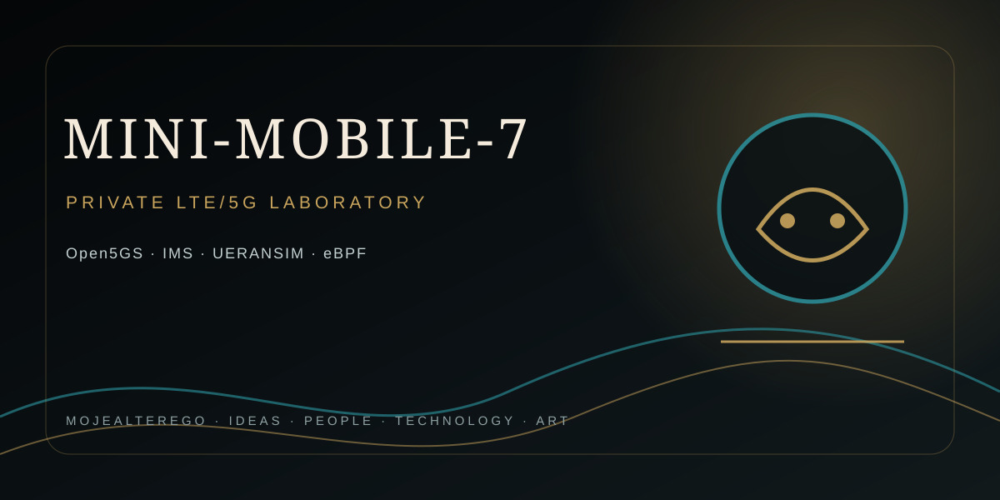

<div align="center">



## MOJEALTEREGO · PROJECT PROFILE

</div>

---

# MINI-MOBILE-7

Private LTE/5G laboratory and private cellular network blueprint for up to 7 controlled devices.

## Scope

This repository contains configuration templates, deployment documentation, security guidance, lab scaffolding, and the Project-72 assurance boundary for a small private mobile network.

Target stack:
- Open5GS Core + MongoDB
- UERANSIM for no-RF laboratory validation
- Kamailio IMS for private voice/IMS experiments
- Asterisk/PJSIP for controlled application voice
- srsRAN or compatible small-cell RAN for physical testing
- Up to 7 controlled subscriber identities

## Network model

```text
Firewall / VPN
      |
 Open5GS Core
      |
 IMS: Kamailio / Asterisk
      |
 LTE / 5G RAN
      |
 7001 ... 7007
```

Public telephony is not intrinsic to the private core. Any gateway capability requires an explicitly authorized lawful interconnect and valid numbering arrangement.

## Addressing

| Segment | CIDR | Purpose |
|---|---|---|
| Core | 10.10.0.0/24 | Core services |
| UE | 10.20.0.0/24 | Subscriber data plane |
| Management | 10.30.0.0/24 | Administration |
| IMS | 10.40.0.0/24 | SIP/IMS services |

Internal test numbers are **7001–7007**, not public Polish mobile numbers.

## Project-72 assurance boundary

Mutating operations require:

1. explicit capability authorization;
2. policy/risk approval;
3. idempotent execution;
4. optimistic concurrency using `expected_version`;
5. authoritative readback;
6. postcondition verification.

Only the complete chain can produce `VERIFIED`. `EXECUTED` alone is never sufficient. The contracts live under `project-72/contracts/` and the implementation under `project_72/`.

## Operations

```bash
make assurance-test
make ims-config-check
make security-check
make metrics-test
make runtime-capabilities
make preflight
make provision-seven
make host-evidence
```

`security-check` is a static source/configuration gate. `runtime-capabilities` is a read-only diagnostic for systemd/kernel/device/network capabilities. `host-evidence` is read-only and captures deployment evidence. None of these substitutes for live host acceptance.

## Runtime environment boundary

The live Project-72 runtime requires a real Linux host or VM with the required kernel/network privileges and systemd service supervision. A 22.04 userland inside Termux/proot can be used for development and ARM64 compilation, but it is not treated as a compliant live Open5GS host when systemd, network administration, TUN, firewall or required kernel interfaces are unavailable.

Run `make runtime-capabilities` first on a candidate host. Then run `make preflight`. The preflight gate must remain fail-closed; do not bypass it to force provisioning in a restricted container or userland environment.

## Monitoring

`monitoring/project_72_metrics.py` renders bounded Prometheus text from an already collected JSON evidence snapshot. It is read-only and does not become a subscriber authority. Sensitive identifiers and authentication material must not be metric labels.

## Backup and recovery

Use `scripts/project-72-backup.sh` with protected runtime MongoDB URIs. It backs up canonical, durable idempotency and optional eSIM metadata domains independently, generates checksums and excludes raw secrets/private keys. The backup uses MongoDB Database Tools `--config` for sensitive connection URIs so credentials are not placed in the `mongodump` process arguments. Restore first into an isolated MongoDB target; follow `docs/backup-recovery.md` before considering production recovery.

## Lab-first rule

The software stack is developed and tested in a no-RF lab first. UERANSIM does not turn an Android phone into a cellular UE; real phones require physical RAN hardware, compatible USIMs, lawful spectrum use and appropriate radio authorization.

## Legal gate

Do not transmit on cellular spectrum until applicable Polish frequency allocation, permit, equipment conformity, location, power, antenna and other regulatory requirements have been verified with UKE. Do not self-assign public numbering or create unauthorized interconnection to public mobile networks.

## Security baseline

- Never commit Ki, OPc, SQN secrets, API keys, passwords, private keys or VPN credentials.
- Keep MongoDB and management interfaces off the public Internet.
- Prefer VPN-only administration.
- Use host firewall/security groups and least-privilege service accounts.
- Store production secrets outside GitHub.
- Use `secret_ref` references in canonical subscriber state.
- Do not use floating `latest` image/package references in deployment baselines.

## Repository layout

```text
core/open5gs/          Core configuration templates
ran/lte/                LTE RAN templates
ran/5g/                 5G RAN templates
ims/kamailio/           IMS configuration scaffolding
ims/asterisk/           Asterisk/PJSIP boundary template
subscribers/templates/ Subscriber templates without real secrets
network/firewall/       Network security baseline
monitoring/             Monitoring and bounded metrics exporter
project-72/contracts/   Machine-readable assurance contracts
project_72/             Assurance Core implementation and tests
docs/                   Architecture, deployment, recovery, legal and status notes
```

## Validation status

Workflow **#369** on `project-72/phase-2a` completed successfully after the latest documentation/runtime-diagnostic changes. The Ubuntu 22.04 CI job passed the Project-72 assurance suite, metrics exporter, IMS static safety gate, security/isolation gate, UERANSIM renderer and Asterisk PJSIP renderer.

The branch also contains a read-only runtime capability diagnostic and a systemd-aware host evidence collector. These tools intentionally expose restricted environments instead of weakening the runtime gate.

CI/source tests do not prove live Open5GS deployment, UERANSIM attachment, UE Internet, IMS TLS/SRTP calls, eSIM installation, physical RAN operation or lawful spectrum use.

## Runtime host requirement

Runtime provisioning requires a real Ubuntu 22.04 host with systemd, MongoDB 8.0, Open5GS services, `ogstun`, IPv4 forwarding, readable firewall policy, durable idempotency storage and externally resolved authentication references. A proot/container environment without systemd or the required network capabilities is intentionally blocked by preflight; it remains suitable for source builds, static checks and deterministic tests only.
